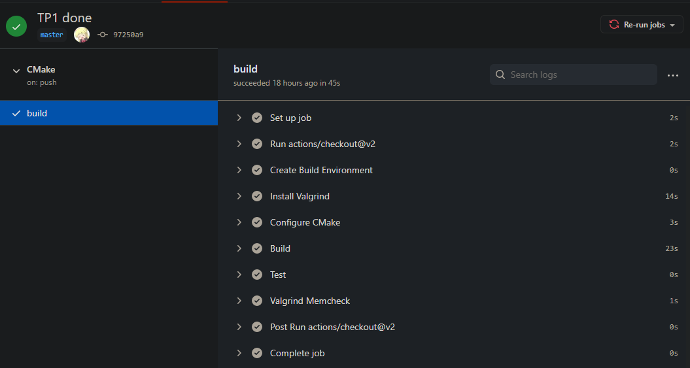

# TP3 C++

## Ajouts dans cette version
  - Support des fonctions curryfiées
  - Ajout des tests sur les fonctions curryfiées
  - Modification de la classe `Token` (suppression de `v()` qui n'était utile que pour les `Literal`)
  - Ajout des tests de curryfication dans `testValgrind.txt`

## Difficultés rencontrés

L'ajout des fonction spécialisées, dont la prise en charge de la syntaxe `pow(_1, 2)` par exemple, aurait nécessité une refonte du projet et du fonctionnement du parseur et le la mémoire des variables. Le temps étant limité avec l'approche des partiels je n'ai pas pu finir d'implémenter cette dernière fonctionnalité dans mon projet. 

## Choix d'implémentation

On a choisi d'ajouter les fonction curryfiées avec une 2ème mémoire qui contient le nom de la nouvelle fonction curryfiée, le nom de la fonction originale, et les arguments déjà spécifiés.
Dans le lexer, la création de nouvelles fonctions curryfiées se fait avec `handleCurryfied()`. On peut ensuite appeller les fonctions comme des fonctions classique après avoir vérifié si la fonction est de type curryfiée et après avoir ajouté les paramètres prédéfinis le cas échéant. A noter que la fonction à nombre variables d'arguments `polynome()` supporte aussi la curryfication.

## Compilation du projet

Le projet utilise le système de build CMake.
Un script `buildrun.sh` permet de compiler, lancer les test et la calculatrice en 1 commande.

Le projet compile sous :

- `clang 10.0.0` sur Windows/Ubuntu
  
- `gcc 7.5.0` sur Ubuntu ou WSL (sous-système Windows pour Linux)

## Tests

Les tests sont regroupés dans le répertoire `\test`. J'ai choisi d'utiliser la libairie de test Googletest qui est l'une des plus populaire ( Catch, Boost.Test et Ctest sont aussi de bons candidats).

Les test sont séparés en 2 fichiers `.cpp` :

- `expressionTest.cpp` : Les tests d'analyse de tokens, crées au début du projet pour vérifier le   fonctionnement de `tokensFromString`

- `programTest.cpp` : Les tests du fonctionnement du programme complet
  - programme en une ligne ( addition, priorités opératoires, parenthèses )
  - programme multi lignes ( variables, affichage ou non avec `;` , calcul du volume d'un cylindre...)

## Fuites mémoire

Le projet a été testé avec `valgrind` pour détecter la présence ou non de 'memleaks' et aucune fuite n'a été trouvée.
Un script `testValgrind.sh` permet de tester les fuites sur un programme type composé de toutes les possibilités du langage. 

## Continuous integration

Le repo de ce projet est hébergé sur github.com (en privé pour éviter la copie), j'en ai donc profité pour expérimenter la continuous intégration avec <a href="https://github.com/features/actions"> Github Actions</a> qui permet d'effectuer une série de test pour valider mes commit à chaque push.

`.github/workflow/cmake.yml` contient le fichier yaml qui s'occupe de cette continuous integration.\
Il y est effectué en autre:

- la compilation du projet avec CMake.

- Le lancement des tests Googletest.

- La vérification de présence des fuites mémoires avec Valgrind.

Exemples d'execution de CI : \

- Execution du "workflow" avec succès :

- Echec de la tache Valgrind Memcheck (ce n'est qu'un exemple, le projet ne contient pas de memleaks) :

